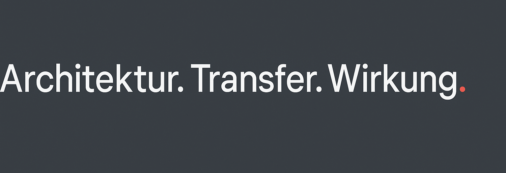

### Architektur. Transfer. Wirkung.

Hi — ich bin Dirk.

Ich arbeite an der Schnittstelle von Training, Coaching und L&D-Beratung. Mit 20 Jahren B2B-Vertrieb und Fuehrung im Hintergrund, und seit drei Jahren mit einem Schwerpunkt darauf, wie KI in Lern- und Entwicklungsprozessen so integriert wird, dass sie traegt — statt nur zu glaenzen.

Auf GitHub liegen die Werkzeuge, die in dieser Arbeit entstehen. Skills fuer Claude Code, Prompts mit Brand-Voice-Logik, Templates fuer Transferarchitekturen, Image-Generation-Guides. Alles, was ich nicht in meinen Trainings als Spezialwissen unter der Hand weitergeben will, sondern als Open-Source-Beitrag fuer alle, die in derselben Richtung denken.

**Was hier nicht passiert:**
- Kein Tool-Hype
- Keine Coaching-Methoden-Show
- Keine bunten Frameworks ohne Substanz

Wenn dich das interessiert, folge gern. Wenn du selbst in der Schnittmenge KI/Learning arbeitest, freu ich mich ueber Austausch.

—

📍 Tbilisi · München  
🔗 [focusinstitute.io](https://focusinstitute.io) · [LinkedIn](https://www.linkedin.com/in/dirkhaeger/)  
📰 Newsletter: Der Maßstab — zweimal pro Woche fuer alle, die Lernen wirksam denken
